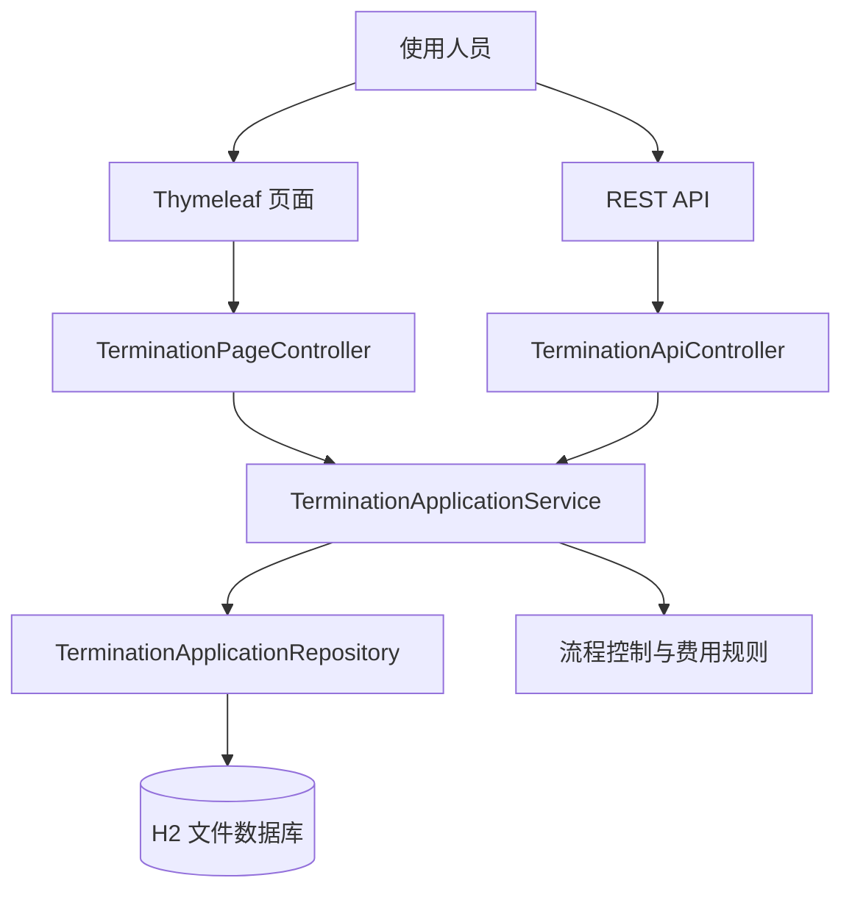

# PowerSupply-Marketing-Termination

[](https://www.oracle.com/java/)
[](https://spring.io/projects/spring-boot)
[](https://maven.apache.org/)
[](https://www.h2database.com/)
[](#)

《智能电网信息处理技术》课程设计项目，主题为营销业务中的 `BM01_009/无表临时用电终止` 业务模块。系统参考 `F01-SGPMSS需求规格说明书（第二篇 新装、增容及变更用电分册 上）` 中的业务描述、流程环节、费用规则和归档要求，实现一个可运行、可演示、可验证的 Java Web 单体应用。

本项目定位为课程设计交付，不按生产级电力营销平台建设。系统重点覆盖“无表临时用电终止”业务闭环，不接入真实外部营销、计费、档案或回访系统。

## 核心特性

- 面向 `BM01_009/无表临时用电终止` 的专用业务模块。
- 覆盖受理、派工、勘查、合同终止、停电、费用确定、费用结清、信息归档、客户回访、最终归档全流程。
- 内置流程状态控制，禁止跳过前置环节直接办理后续业务。
- 按课程设计范围实现无表临时用电退补费规则。
- 提供 Thymeleaf 前端页面，支持业务台账、新增受理、详情查看和环节操作。
- 提供 REST 接口，便于接口层验证和后续扩展。
- 使用 H2 文件数据库，便于本地运行、课堂演示和数据留存。
- 保留规范化过程性文档，支持课程设计报告和答辩说明。
- 已补充自动化测试，覆盖服务层、接口层、页面层和启动冒烟场景。

## 技术栈

| 层级 | 技术 |
| --- | --- |
| 运行环境 | Java 21 |
| 后端框架 | Spring Boot 3.3.5 |
| Web 层 | Spring MVC |
| 页面模板 | Thymeleaf |
| 持久化 | Spring Data JPA / Hibernate |
| 数据库 | H2 文件数据库 |
| 构建工具 | Maven |
| 测试 | JUnit 5、Spring Boot Test、MockMvc、AssertJ |

## 系统架构



### 分层说明

| 层级 | 主要目录 | 说明 |
| --- | --- | --- |
| 页面层 | `src/main/resources/templates` | 业务台账页、详情页、导航片段 |
| 控制层 | `src/main/java/.../controller` | 页面请求与 REST API 入口 |
| 服务层 | `src/main/java/.../service` | 业务流程、状态校验、费用计算 |
| 领域层 | `src/main/java/.../domain` | 业务实体和流程状态枚举 |
| 数据层 | `src/main/java/.../repository` | JPA 数据访问接口 |
| 静态资源 | `src/main/resources/static` | 页面样式文件 |
| 测试代码 | `src/test/java` | 自动化测试用例 |
| 文档 | `docs/` | 使用说明和过程性文档 |

## 业务流程


### 流程状态

| 状态编码 | 页面名称 | 业务含义 |
| --- | --- | --- |
| `ACCEPTED` | 业务受理 | 已登记客户、合同、容量、预收电费和申请终止日期 |
| `DISPATCHED` | 勘查派工 | 已分配现场勘查人员 |
| `FIELD_INSPECTED` | 现场勘查 | 已记录现场核实情况 |
| `CONTRACT_TERMINATED` | 终止合同 | 已办理临时供用电合同终止 |
| `POWER_OFF` | 停电 | 已记录停止供电 |
| `FEE_DETERMINED` | 确定费用 | 已按实际使用天数计算退费或补收 |
| `FEE_SETTLED` | 结清费用 | 已记录收费、退费或欠费信息 |
| `INFO_ARCHIVED` | 信息归档 | 已登记档案位置和资料状态 |
| `CALLBACK_DONE` | 客户回访 | 已完成客户回访记录 |
| `ARCHIVED` | 归档 | 已完成最终归档，业务闭环结束 |

## 费用规则

系统按照需求规格说明书中无表临时用电终止场景的课程设计化规则实现：

| 判断条件 | 处理结果 |
| --- | --- |
| 实际使用天数小于约定期限的一半 | 退还预收电费的二分之一 |
| 实际使用天数大于等于约定期限的一半，且未超过约定期限 | 不退费、不补收 |
| 实际使用天数超过约定期限 | 按 `预收电费 / 约定天数 * 超期天数` 补收 |

金额统一按两位小数保存和展示。

## 快速开始

### 环境要求

| 软件 | 建议版本 |
| --- | --- |
| JDK | 21 |
| Maven | 3.9+ |
| Git | 任意较新版本 |

### 克隆项目

```powershell
git clone https://github.com/AndyXuPrime/PowerSupply-Marketing-Termination.git
cd PowerSupply-Marketing-Termination
```

### 启动系统

推荐使用项目内 Maven settings，依赖会写入项目本地 `.m2/repository`，避免受全局 Maven 仓库权限影响。

```powershell
mvn -s .mvn/settings.xml spring-boot:run
```

也可以先打包再运行：

```powershell
mvn -s .mvn/settings.xml -DskipTests package
java -jar target/power-supply-marketing-termination-0.1.0-SNAPSHOT.jar
```

### 访问地址

| 页面 | 地址 | 说明 |
| --- | --- | --- |
| 业务前端 | `http://localhost:8080/applications` | 业务台账、受理和环节办理入口 |
| 默认入口 | `http://localhost:8080` | 自动跳转到业务台账 |
| H2 控制台 | `http://localhost:8080/h2-console` | 查看本地数据库 |

H2 控制台连接参数：

| 参数 | 值 |
| --- | --- |
| JDBC URL | `jdbc:h2:file:./data/termination-db` |
| User Name | `sa` |
| Password | 空 |

## 使用入口

系统页面操作请参考 [详细使用说明](docs/user-guide.md)。

典型操作顺序：

1. 进入业务台账页。
2. 在“新增受理”区域录入客户、合同、容量、预收电费和申请终止日期。
3. 进入详情页，按页面显示的当前环节依次办理派工、勘查、合同终止、停电、费用确定、费用结清、信息归档、客户回访和最终归档。
4. 在业务台账中查看状态变化和归档结果。

## REST API

REST API 统一前缀为 `/api/applications`。

| 方法 | 路径 | 说明 |
| --- | --- | --- |
| `GET` | `/api/applications` | 查询申请列表，支持 `keyword` 和 `status` 参数 |
| `GET` | `/api/applications/{id}` | 查询申请详情 |
| `POST` | `/api/applications` | 创建申请 |
| `POST` | `/api/applications/{id}/dispatch` | 勘查派工 |
| `POST` | `/api/applications/{id}/survey` | 现场勘查 |
| `POST` | `/api/applications/{id}/contract-terminate` | 终止合同 |
| `POST` | `/api/applications/{id}/power-off` | 停电 |
| `POST` | `/api/applications/{id}/determine-fee` | 确定费用 |
| `POST` | `/api/applications/{id}/settle-fee` | 结清费用 |
| `POST` | `/api/applications/{id}/archive-info` | 信息归档 |
| `POST` | `/api/applications/{id}/callback` | 客户回访 |
| `POST` | `/api/applications/{id}/archive` | 最终归档 |

## 测试验证

```powershell
mvn -s .mvn/settings.xml test
```

当前自动化测试覆盖：

| 测试类 | 覆盖内容 |
| --- | --- |
| `TerminationApplicationServiceTest` | 费用规则、完整流程、非法状态控制 |
| `TerminationApiControllerTest` | REST 查询、业务操作和异常响应 |
| `TerminationPageControllerTest` | 页面渲染和表单提交跳转 |
| `PowerSupplyTerminationApplicationSmokeTest` | Spring Boot 启动和样例页面访问 |

最近验证结果：11 个测试全部通过。

## 项目结构

```text
PowerSupply-Marketing-Termination/
├── .mvn/                         # 项目级 Maven 配置
├── data/                         # H2 文件数据库目录
├── docs/
│   ├── user-guide.md             # 详细使用说明
│   └── process/                  # 课程设计过程性文档
├── src/
│   ├── main/
│   │   ├── java/com/andyyu/powersupply/termination/
│   │   │   ├── controller/       # 页面控制器和 REST 控制器
│   │   │   ├── domain/           # 实体和状态枚举
│   │   │   ├── repository/       # JPA 仓库
│   │   │   └── service/          # 业务服务
│   │   └── resources/
│   │       ├── templates/        # Thymeleaf 页面
│   │       ├── static/           # CSS 静态资源
│   │       └── application.properties
│   └── test/                     # 自动化测试
├── pom.xml
└── README.md
```

## 文档目录

| 文档 | 说明 |
| --- | --- |
| [docs/user-guide.md](docs/user-guide.md) | 系统详细使用说明、操作流程、字段和专业术语解释 |
| [docs/process/00-document-control.md](docs/process/00-document-control.md) | 文档控制 |
| [docs/process/01-requirements-analysis.md](docs/process/01-requirements-analysis.md) | 需求分析 |
| [docs/process/02-architecture-design.md](docs/process/02-architecture-design.md) | 架构设计 |
| [docs/process/03-implementation-plan.md](docs/process/03-implementation-plan.md) | 实施计划 |
| [docs/process/04-test-record.md](docs/process/04-test-record.md) | 测试记录 |
| [docs/process/05-current-status.md](docs/process/05-current-status.md) | 阶段总结 |
| [docs/process/06-issues-and-solutions.md](docs/process/06-issues-and-solutions.md) | 问题与解决方案 |
| [docs/process/07-testing-and-verification.md](docs/process/07-testing-and-verification.md) | 测试与验证 |

## 开发与维护说明

### 常用命令

```powershell
# 运行测试
mvn -s .mvn/settings.xml test

# 打包
mvn -s .mvn/settings.xml -DskipTests package

# 启动
mvn -s .mvn/settings.xml spring-boot:run

# 查看 Git 提交历史
git log --oneline --graph -10
```

### 数据说明

系统使用 H2 文件数据库，数据默认保存在 `data/termination-db`。如果需要重新初始化演示数据，可以停止应用后清理 `data/` 目录中的 H2 数据文件，再重新启动系统。

## 项目范围说明

本项目已经完成课程设计范围内的核心实现。以下内容不属于当前交付范围：

- 不接入真实电力营销系统。
- 不接入真实计费、档案、回访、短信或统一认证平台。
- 不实现生产级权限体系、审计体系、性能压测和安全加固。
- 不完整覆盖需求规格说明书中的所有扩展字段，仅保留本业务闭环所需字段。
